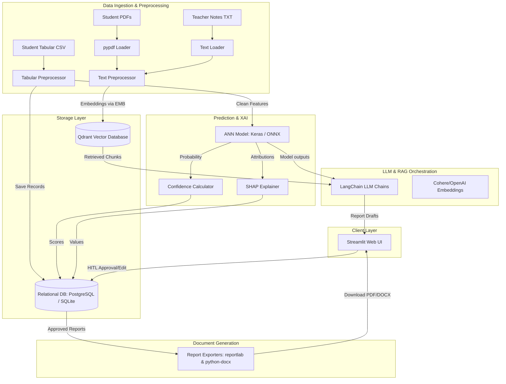

# System Architecture: AI Co-Pilot for Education Analytics

This document details the production-grade architecture of the AI Co-Pilot, showing the relationships between data ingestion, predictive modeling, database storage, and LLM reasoning.

## 1. Component Diagram

## 2. Subsystem Definitions

### Data Modalities & Loaders
- **Tabular Data**: Student demographic and quantitative grades preprocessed using standard scaling and categorical encoding. Saves baseline entries in the Relational DB.
- **PDF & Unstructured Text**: Parsed via `pypdf` or direct streams, split into overlapping chunks, and indexed in Qdrant with student-level metadata tags.

### ML & Explainability Subsystem
- **ANN Predictor**: Keras dense network with BatchNormalization and Dropout predicting classification probabilities. Running via `.keras` or `.onnx` runtimes.
- **SHAP (SHapley Additive exPlanations)**: KernelExplainer using a synthesized k-means reference background to map feature-level contributions for single student predictions.
- **Confidence Metrics**: Normalized certainty score mapped using distance from the threshold boundary.

### Database Layer
- **Relational DB**: SQLAlchemy schema storing `students`, `student_tabular_data`, `prediction_records`, `review_records` (HITL audit logs), and `report_records`.
- **Vector Database**: Qdrant vector database (running in-memory locally) holding chunked notes mapped to `student_id` fields.

### Orchestration & Document Output
- **LangChain Chains**: Orchestrates summarization of qualitative files, reasoning over quantitative predictions, and final document drafting.
- **Exporters**: Converts structured Pydantic objects into ReportLab tables (PDF) and python-docx elements (Word).
